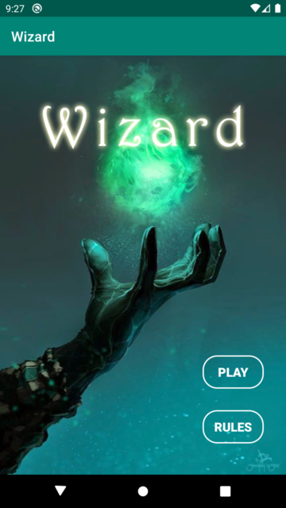

# Wizard Cardgame for Android implemented in Java

## Description
Wizard is a popular multiplayer cardgame for 3-6 players. It is played with a deck of 60 cards, which consist of 4 different colors.
There are also 2 special colored cards: Wizards and Jesters, which have special meaning. Both can always be played but the first Wizard played in a trick
always wins the trick whereas the Jesters can't win a trick at all and serve only to save special cards for the next trick.

## Rules

### Cheating
Cheating is implemented per round in the sense, that players are always allowed to play any card in their hand,
even if it violates the rules of the game. But be careful, cheating is recognized by the gameserver and other
players have the possibility call out a cheater and get bonus points. The cheater in turn will be punished by a hefty penalty.
Another detail making the cheating fun, is that only the first player to call out a cheater will be awarded the bonus, whereas the
second player calling out the cheater will already be punished with penalty points instead. So to reveal a cheater and receive the bonus,
you need to be quick! Otherwise chances are you'll get punished yourself instead.

Since cheating works per round, cheaters can only be called out if they cheated in the current round.
Past rounds are not considered anymore, meaning that they got away with it.

## Technical Details
The game was developed using Android Studio and Android target SDK version 28, but should also work
with any version higher 19. The multiplayer game consists of an Android client app and a separate
game server implemented purely in Java SE. The requirements to be able to play the game are:
 - the server has to be hosted separately on a server of your choice
 - there need to be at least 3 players/clients, otherwise you won't be able to really play but only see the lobby where you'd need to wait for other players

**Have fun playing** :+1:
