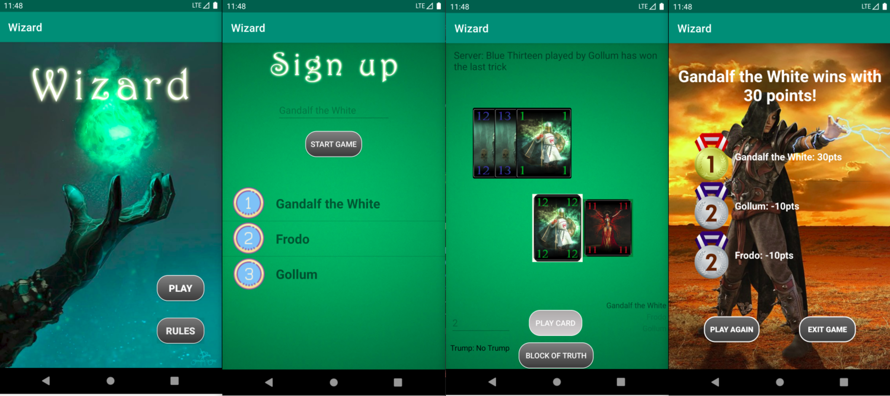

# Wizard Cardgame for Android implemented in Java :coffee:

## Description
Wizard is a popular multiplayer cardgame for 3-6 players. It is played with a deck of 60 cards, which consist of 4 different colors.
There are also 2 special colored cards: Wizards and Jesters, which have special meaning. Both can always be played but the first Wizard played in a trick
always wins the trick whereas the Jesters in general can't win a trick at all, except in the case only Jesters are played, then the first Jester
played wins, and basically serve only to save great cards for the next trick.

## Rules
In the first round every player gets one card. In the subsequent rounds the number of cards is increased
by one until all cards are distributed. That means that three players play 20 rounds, four players 15 rounds,
five players 12 rounds and six players 10 rounds. The top card of the remaining cards is turned over to
determine the trump suit. If there are no cards left or a jester is turned, there is no trump suit, and only the
wizards are trump. If a wizard is turned, the dealer picks a trump suit.

After looking at their cards, starting with the player to the dealer's left, each player states how many tricks
he believes he will take, from zero to the number of cards dealt. This is recorded on the Block of Truth. If a
card other than a wizard or jester is played, the players have to follow suit, but it is possible to play a
jester or wizard although the player has the desired suit. The jester is beaten by all others and the wizard
beats all others.

At the end of each round, each player is given a score based on his performance. For predicting the number
of tricks taken correctly, a player receives 20 points plus 10 points for each trick taken. For predicting the
number of tricks taken incorrectly, a player loses 10 points for each trick over or under the prediction.

### Cheating
Cheating is implemented per round in the sense, that players are always allowed to play any card in their hand,
even if it violates the rules of the game. But be careful, cheating is recognized by the gameserver and other
players have the possibility call out a cheater and get bonus points. The cheater in turn will be punished by a hefty penalty.
Another detail making the cheating fun, is that only the first player to call out a cheater will be awarded the bonus, whereas the
second player calling out the cheater will already be punished with penalty points instead. So to reveal a cheater and receive the bonus,
you need to be quick! Otherwise chances are you'll get punished yourself instead.

Since cheating works per round, cheaters can only be called out if they cheated in the current round.
Past rounds are not considered anymore, meaning that they got away with it.

To call out the cheater use the light sensor of your android device and a Pop-up window will appear.
Select the player which could be a cheater and if you detect right and the player actually cheated he'll get -10 penalty
points and you'll get +10  bonus points. Should the tip be wrong you will get -10 penalty points.

## Technical Details
The game was developed using Android Studio and Android target SDK version 28, but should also work
with any version higher 19. The multiplayer game consists of an Android client app and a separate
game server implemented purely in Java SE. The requirements to be able to play the game are:
 - the server has to be hosted separately on a server of your choice (IP needs to be set in app/src/main/java/.../WizardClient.java)
 - there need to be at least 3 players/clients, otherwise you won't be able to really play but only see the lobby where you'd need to wait for other players

**Have fun playing** :+1:
